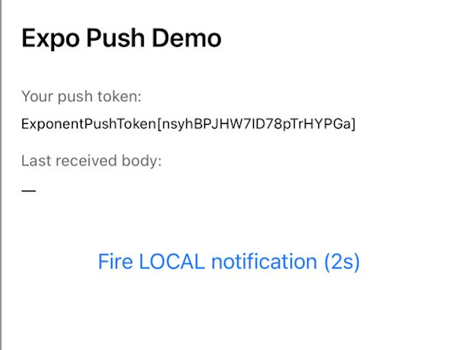
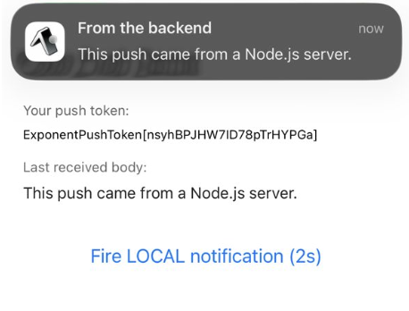
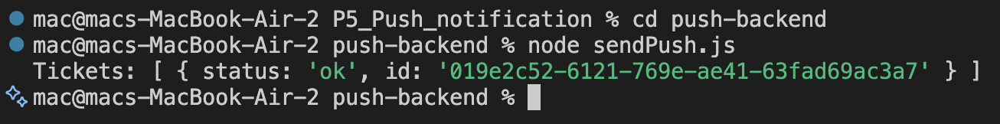

## Practical 5 Report

| | |
|---|---|
| **Submitted By** | Yeshey Lhaden |
| **Enrollment No.** | 02240371 |
| **Programme** | 2 BESWE |
| **Date** | 07/04/2025 |

---

## Table of Contents
 
- [1. Title](#1-title)
- [2. Purpose](#2-purpose)
- [3. Objectives](#3-objectives)
- [4. Learning Outcome](#4-learning-outcome)
- [5. Requirements](#5-requirements)
- [6. Procedure](#6-procedure)
- [7. Program / Code](#7-program--code)
- [8. Output](#8-output)
- [9. Observations](#9-observations)
- [10. Challenges Faced](#10-challenges-faced)
- [11. Conclusion](#11-conclusion)

---

## 1. Title

**Push Notifications Implementation in React Native Mobile Application With Expo**

---

## 2. Purpose

To develop and demonstrate the implementation of push notifications functionality in a mobile application built with React Native and Expo, making it possible for the application to get remote messages from a backend service regardless of whether the application is working in the background or is not active at all.

---

## 3. Objectives

- Gain insight into push notifications flow on Android and iOS.
- Configure a project for push notifications development using Expo packages.
- Implement code to request permissions and generate push token in the application.
- Use Expo Notification Tool (web interface) to send a test notification to a physical device.
- Create a simple Node.js server for sending push notifications through Expo Push API.
- Implement event handling for push notifications received in foreground and tapped.

---

## 4. Learning Outcome

After undertaking this practical exercise, the learner should be able to:

- Describe the whole process of delivery of a push notification from the server all the way down to the device.
- Customize and set up the `expo-notifications`, `expo-device`, and `expo-constants` libraries.
- Differentiate an Expo Push Token from a Project ID and a Bundle Identifier, and know where to obtain each of them.
- Build a test version of an app using `npx expo run:android` command, and test it on a real Android device.
- Test sending push notifications via the web Expo Push Tool and a Node.js server.
- Manage foreground notifications and app response after a user taps the notification.
- Resolve issues associated with the delivery of push notifications.

---

## 5. Requirements

### 5.1 Hardware

- A laptop/desktop computer (Windows / macOS / Linux)
- A physical Android mobile device (notifications will not be sent via simulation)
- A USB cable to connect the device to your computer

### 5.2 Software & Tools

| Name | Version / Details | Reason |
|------|-------------------|--------|
| Node.js | v20 LTS or later | Runtime for Expo CLI and server-side push |
| npm | Comes with Node.js | Package management |
| EAS CLI | Latest (`npm install -g eas-cli`) | Register and build the project |
| VS Code | Latest | Source code editing tool |
| Expo account | Free (expo.dev/signup) | For the projectId and Push Tool |
| expo-notifications | SDK-compliant | Core package for notifications |
| expo-device | SDK-compliant | For detecting the actual device (not simulation) |
| expo-constants | SDK-compliant | Reads projectId from app.json |
| expo-server-sdk (Node) | ^3.10.0 | Server-side push notifications SDK |

---

## 6. Procedure

### Step 1: Install System Tools

Download and install Node.js (version v20 LTS) from [nodejs.org](https://nodejs.org), then install the EAS CLI globally:

```bash
npm install -g eas-cli
eas --version    # Check for successful installation
```

### Step 2: Creating the Expo Project

Make a new TypeScript project and enter the directory:

```bash
npx create-expo-app@latest PushDemo --template
# Choose: Blank (TypeScript)
cd PushDemo
```

### Step 3: Installing Required Modules

Use `npx expo` instead of `npm` to ensure compatibility with the SDK:

```bash
npx expo install expo-notifications expo-device expo-constants
```

### Step 4: Creating an Expo Account and Getting Project ID

Sign up at [expo.dev/signup](https://expo.dev/signup), then log in and initialise the project using EAS:

```bash
eas login
eas init    # Creates your project on EAS and adds projectId to app.json
```

The `projectId` field in `app.json` will look like:

```json
"extra": {
  "eas": {
    "projectId": "abcd1234-ef56-7890-ab12-34567890cdef"
  }
}
```

### Step 5: Set Up app.json

Include `bundleIdentifier`, package name, and the `expo-notifications` plugin within `app.json`. Do not alter the value of the `projectId` acquired by `eas init`.

### Step 6: Coding the App (App.tsx)

Replace the existing content of `App.tsx` with the following logic:

- Sets up a global notification handler using `setNotificationHandler()` to present alerts in the foreground.
- Implements the `registerForPushNotificationsAsync()` method, which detects whether there is a device in use, establishes an Android channel, requests permission, reads the value of `projectId` in `app.json` using `expo-constants`, and invokes `getExpoPushTokenAsync()`.
- Shows the received `ExponentPushToken` on-screen.
- Listens to foreground and background notifications using listeners.
- Includes a button to trigger a local test notification after 2 seconds.

### Step 7: Build and Run on a Physical Android Device

Enable USB debugging on the Android phone:

> **Settings → About Phone → tap Build Number seven times → enable USB Debugging**

Connect the phone to the computer with USB and run:

```bash
npx expo run:android
```

> The first build may take between 5 and 15 minutes. Once completed, the application is installed onto the phone. Upon receiving the permission request to allow notifications, the Expo Push Token becomes available on-screen (e.g., `ExponentPushToken[Xx9k5l-2nW1qABCDeFGHi]`).

### Step 8: Send a Test Push Using Browser

1. Browse to [https://expo.dev/notifications](https://expo.dev/notifications).
2. Paste the push token in the **Expo Push Token** field.
3. Enter **Title:** `Hello`, **Body:** `My first push notification`, **Data:** `{"screen":"Home"}`.
4. Press **Send a Notification**, put your phone to sleep mode and wait.
5. In a few seconds a notification pops up on the phone's lock screen.

### Step 9: Send a Push from Node.js Backend

Create a separate backend directory, install `expo-server-sdk`, and run the script:

```bash
mkdir push-backend && cd push-backend
npm init -y
npm install expo-server-sdk
# Add "type": "module" in package.json
node sendPush.js
```

The `sendPush.js` file will validate the token, create a message object, chunk it, and call `expo.sendPushNotificationsAsync()`, which sends the message through Expo's servers → Google's FCM servers → the device.

---

## 7. Program / Code

Source code for this practical can be found at:

**Repository:** [https://github.com/Yesheylhaden/SWE201_02240371_practicals.git](https://github.com/Yesheylhaden/SWE201_02240371_practicals.git)

**Key source files:**

- `App.tsx` — Main application file containing notification registration and event handling.
- `app.json` — Expo configuration containing `projectId`, `bundleIdentifier`, package name, and plugins.
- `push-backend/sendPush.js` — Push delivery demo using a Node.js script.
- `push-backend/package.json` — Backend dependencies (`expo-server-sdk`).

---

## 8. Output

The following screenshots were captured during the practical execution:

- **Figure 1:** App running on device showing the Expo Push Token


- **Figure 2:** Push notification received on lock screen (remote push from browser tool)


- **Figure 3:** Terminal output showing successful ticket response from the Node.js backend script


---

## 9. Observations

While executing the practical, the following observations were noted:

- The generation of the Expo Push Token could be done **only on an actual Android device**. When executed on an emulator, the result was `null` with an error message: *"Please use a physical device for push notifications"* — implying that FCM must work on actual hardware.

- The token remains valid until the application is uninstalled. Reinstallation results in a new token altogether, hence the need for implementing a token refresh feature.

- Notifications sent via the browser-based Expo Push Tool reached the application in **2 to 5 seconds** while on Wi-Fi with the phone in background state. The process took longer when using mobile data.

- When the application was in foreground mode, the `setNotificationHandler` function effectively blocked pop-up notifications and instead showed them as a banner with `shouldShowBanner: true`.

- Pressing the notification while the app was running in the background caused `addNotificationResponseReceivedListener` to fire, and the content payload was shown in a dialog window — demonstrating how deep linking works in actual applications.

- The Node.js backend script using `expo-server-sdk` delivered the push successfully. A ticket status of `'ok'` indicates Expo added the message to its queue. The phone received the notification in approximately **3 seconds**.

- On Xiaomi phones, notifications only came through after disabling battery saver limitations:
  > **Settings → Apps → PushDemo → Battery → No Restrictions**

---

## 10. Challenges Faced

| Challenge | Solution |
|-----------|----------|
| Error "SDK location not found" when running `npx expo run:android` | Android Studio was not installed. Installed Android Studio, let it install the default SDK, then relaunched the terminal so that the `ANDROID_HOME` environment variable could be properly set. |
| Warning "Project ID not found" on opening the app — `eas init` had not been executed | Ran `eas init` within the project directory; the project's UUID was inserted automatically into `app.json`. |
| Notification not delivered to Xiaomi device — MIUI Battery Optimizer was stopping the app from running in the background | Turned off the battery optimization restriction for PushDemo in **Settings → Apps → Battery**. |
| Token status still showing "Fetching..." and unable to resolve — could not work with Push Token inside Expo Go on Android SDK 53 | Expo Go doesn't support remote push notifications from SDK 53 onwards. Used development mode with `npx expo run:android` instead. |
| TypeScript error: `"Property 'shouldShowBanner' does not exist"` | The previous version's types didn't include `shouldShowBanner`. Temporarily worked around the problem by casting the handler result as `any`. |

---

## 11. Conclusion

This practical has demonstrated the entire process of push notifications within a React Native application through Expo — from the initial stages of setting up the project, registering a push token, receiving push messages, and interacting with them. The key takeaway is that push notifications depend on a chain of services including Expo, Firebase Cloud Messaging (FCM) / Apple Push Notification Service (APNs), and the device operating system. **Testing with a physical device is necessary**, since simulators and Expo Go (SDK 53 onwards) cannot receive remote push notifications.